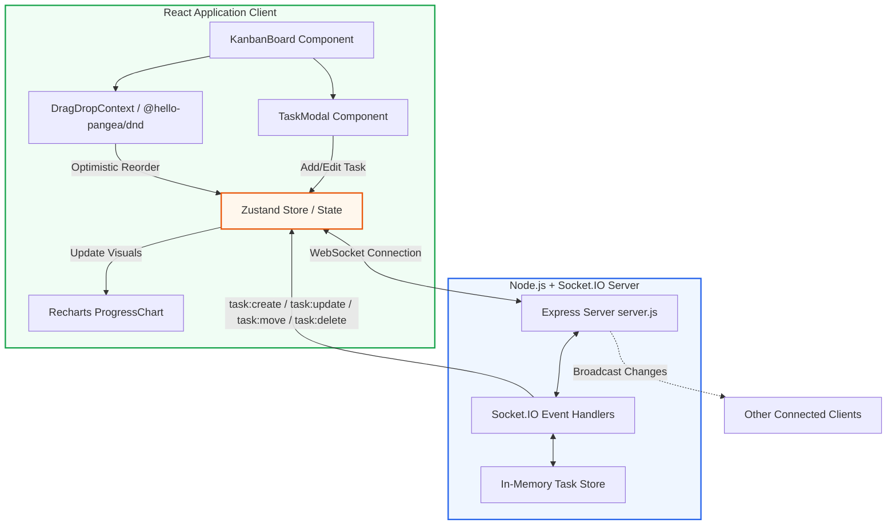

# 📝 KanbanBoard — Real-Time Task Management

A professional, real-time Kanban board application built with React, WebSockets (Socket.IO), and Vite. Track assignments, projects, and daily tasks across **To Do**, **In Progress**, and **Done** columns with seamless drag-and-drop interactions, live progress metrics, file attachments, and instant synchronization.

> **Developer:** Shruti Srivastava | [sri.shruti24@gmail.com](mailto:sri.shruti24@gmail.com)

---

## 🏗️ System Architecture & Data Flow

The diagram below illustrates how client interactions (drag-and-drop, task CRUD operations) are processed optimistically in the frontend and synchronized across connected users in real time via WebSockets.



---

## ✨ Features

* **Neo-Brutalist Design System:** Clean, bold borders, card shadows, custom fonts, and curated neo-brutalist aesthetics.
* **Optimistic Drag & Drop:** Move cards between columns smoothly with instant UI response using `@hello-pangea/dnd`.
* **Real-Time Synchronisation:** Updates propagate instantly across all open browser instances using Socket.IO.
* **Task Management (CRUD):** Easily create, edit, view, and delete task cards with dedicated properties.
* **Rich Task Attributes:** Define priority levels (Low, Medium, High) and categories (Bug, Feature, Enhancement).
* **Attachments:** Upload supporting files (images and PDFs) with file previews.
* **Interactive Data Visualization:** Custom progress bar chart rendering task distributions and real-time completion percentages.
* **Fully Responsive:** Optimized layouts for mobile devices, tablets, and wide screens.

---

## 🛠️ Tech Stack

| Layer | Technologies |
| :--- | :--- |
| **Frontend Framework** | React 19, Vite 6, JavaScript (ES6+) |
| **Styling** | Vanilla CSS, HSL color tokens, neo-brutalist theme variables, Outfit typeface |
| **State Management** | React hooks with optimistic update patterns |
| **Drag & Drop Engine** | `@hello-pangea/dnd` |
| **WebSocket Protocol** | `socket.io-client` |
| **Charts & Graphs** | Recharts (Responsive bar chart & progress trackers) |
| **Icon Library** | Lucide React |
| **Select Controls** | React Select |
| **Backend Runtime** | Node.js, Express, Socket.IO Server |
| **Testing Suite** | Vitest, React Testing Library, Playwright (E2E) |

---

## 🚀 Local Setup Instructions

### Prerequisites
* **Node.js** (v18 or higher recommended)
* **npm** (v9 or higher recommended)

### 1. Clone the Project
```bash
git clone https://github.com/SriShruti24/personal-kanban-board.git
cd personal-kanban-board
```

### 2. Start the Backend Socket Server
```bash
cd backend
npm install
npm start
```
The server will boot on `http://localhost:5000`.

### 3. Start the Frontend Application
In a separate terminal:
```bash
cd frontend
npm install
npm run dev
```
The Vite development server will open the application on `http://localhost:3000`.

### 4. Run Test Suites
```bash
# Execute unit and integration tests (Vitest)
npm run test

# Execute End-to-End browser tests (Playwright)
npm run test:e2e
```

---

## 📸 Screenshots

Below are placeholders to showcase your application screens. Add your image files to a `/screenshots` folder or link directly to hosted assets.

### 💻 Desktop View — Board Overview
---
```
+-----------------------------------------------------------------------------+
|                                                                             |
|                                [ PLACEHOLDER ]                              |
|                              Desktop Board View                             |
|                                                                             |
+-----------------------------------------------------------------------------+
```
*(Insert Desktop board screenshot here)*

<br>

### 📊 Live Analytics & Progress Chart
---
```
+-----------------------------------------------------------------------------+
|                                                                             |
|                                [ PLACEHOLDER ]                              |
|                               Recharts Analytics                            |
|                                                                             |
+-----------------------------------------------------------------------------+
```
*(Insert progress chart and completion percentage screenshot here)*

<br>

### 📱 Responsive Mobile Display
---
```
+--------------------------+
|                          |
|      [ PLACEHOLDER ]     |
|       Mobile Layout      |
|                          |
+--------------------------+
```
*(Insert Mobile responsive layout screenshot here)*

<br>

### 📝 Task Creation & Attachment Preview
---
```
+-----------------------------------------------------------------------------+
|                                                                             |
|                                [ PLACEHOLDER ]                              |
|                            TaskModal & File Upload                          |
|                                                                             |
+-----------------------------------------------------------------------------+
```
*(Insert Modal dialog with file attachments screenshot here)*

---

## 📁 Repository Directory Structure

```
websocket-kanban-vitest-playwright/
├── backend/
│   ├── server.js              # Express app initialization & Socket.IO server config
│   ├── socket/                # Socket.IO client-action event listeners
│   ├── store/                 # Server-side in-memory task database
│   ├── services/              # Server business logic
│   ├── utils/                 # General backend utilities
│   └── tests/                 # Server unit and integration tests
│
├── frontend/
│   ├── index.html             # Client entrypoint, custom favicon, SEO tags
│   ├── vite.config.js         # Build tooling configurations and Vitest options
│   ├── src/
│   │   ├── App.jsx            # Layout container for KanbanBoard
│   │   ├── main.jsx           # App bootstrapping and stylesheet mounting
│   │   ├── index.css          # Styling rules, animations, and CSS variables
│   │   ├── components/
│   │   │   ├── KanbanBoard.jsx    # Component containing board headers, filters, columns
│   │   │   ├── Column.jsx         # Card container dropping wrapper
│   │   │   ├── TaskCard.jsx       # Card element representing tasks
│   │   │   ├── TaskModal.jsx      # Portal window containing CRUD task forms
│   │   │   ├── ProgressChart.jsx  # Chart components using Recharts
│   │   │   └── Footer.jsx         # Author info, email contact, and branding links
│   │   ├── store/             # Zustand state management
│   │   ├── services/          # Socket emission helper methods
│   │   ├── socket/            # Core Socket.IO connection client
│   │   └── tests/             # Client integration, unit, and Playwright tests
│   └── package.json
│
└── README.md                  # Detailed repo guide
```
